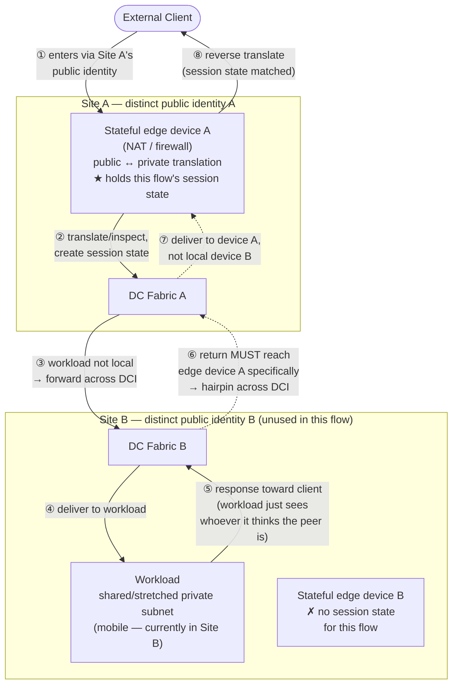

# Multi-Site DC with Cross-Site Workload Mobility

The general shape: two (or more) DC sites, each with its own fabric, joined by a
stretched/shared addressing plane so workloads can migrate between sites without
re-IP — but each site keeps its own **distinct, independent identity toward the
outside world** (its own public IP range, its own internet/WAN edge, its own
stateful firewall). That mismatch — shared internally, distinct externally — is
the root of every traffic-symmetry problem in this scenario, not a corner case
of any one vendor's implementation.

## Topology and traffic flow

Vendor-neutral shape of the problem — the concrete enforcement mechanism
(named "redirect mechanism" here) differs per platform and is documented in
the relevant vendor file, not here (see Composes below).

The two facts this diagram exists to make visible: (1) the workload's location
is decoupled from the public identity used to reach it — that's the whole
point of the stretched/shared addressing plane — and (2) the return leg is
therefore *not* free to take the locally-convenient path through Site B's own
edge device, because that device has no session state for the flow. Steps ⑥–⑦
are where a vendor-specific redirect mechanism has to intervene; without one,
default routing would send the response out Site B's local edge instead and
the flow would fail (silently, for NAT, or via inspection drop, for a plain
stateful firewall).

## Composes

1. [skills/techniques/spine-leaf-clos.md](../techniques/spine-leaf-clos.md) and
   [evpn.md](../techniques/evpn.md) — the stretched fabric itself: DCI between
   sites, Type-5 route summarization vs. stretched L2/L3, and the underlying
   reason a workload's location can be decoupled from its addressing in the
   first place.
2. [skills/techniques/multi-tenancy.md](../techniques/multi-tenancy.md) — the
   VRF/segmentation boundary between the shared-internally addressing plane and
   whatever per-site external identity (VRF, L3Out, internet edge) sits outside
   it.
3. The relevant vendor DC-fabric file for the actual enforcement mechanism —
   this is where the concrete solution lives, not in this file (see Maintenance
   in [SKILL.md](../../SKILL.md) for why). Currently documented:
   [skills/vendor-matrix/cisco/aci.md](../vendor-matrix/cisco/aci.md#multi-site-stretched-workload-with-per-site-nat)
   — Policy-Based Redirect anchored to a specific, named device rather than a
   proximity-based/local one.
   [skills/vendor-matrix/cisco/nxos-vxlan.md](../vendor-matrix/cisco/nxos-vxlan.md)
   does not yet have an equivalent documented — confirm and add before relying
   on it for an NX-OS-native (non-ACI) Multi-Site design; don't assume ePBR
   solves this the same way without checking, since ACI's anchoring mechanism
   is a property of its provider-leaf PBR enforcement model specifically.

## Cross-cutting judgment

- Two distinct severities of this problem exist, and they need different fixes
  — don't reach for the heavier one by default:
  - **Plain stateful-firewall asymmetry** (independent, non-NAT firewalls per
    site, either one can legitimately inspect a flow) — solvable by keeping
    ingress/egress paths topologically aligned, e.g. granular host-route
    advertisement so traffic naturally enters at the site the workload lives
    on.
  - **NAT specifically** is stricter: the return packet must reach the *exact*
    device that created the translation entry — no independent peer device can
    substitute, even with a shared security policy. This is what turns "keep
    paths aligned" into "pin the flow to one specific device."
- The general fix for the NAT case is a pattern, not a vendor feature: when a
  stateful/NAT device's identity is tied to a fixed external resource (a public
  IP range, in this scenario) but the workload behind it is not similarly
  fixed, the redirect mechanism must target that *specific device* explicitly
  — never resolve it by proximity/locality — and the resulting cross-site
  hairpin on the return leg is the accepted cost of correctness, not a defect
  to engineer away.
- If the hairpin cost is unacceptable at the traffic volume in question, the
  fix is architectural, not a redirect-policy tweak: decouple the two
  independence assumptions causing the conflict — e.g. don't let
  internet-facing (NAT'd) tiers migrate independently of their public
  IP/DNS record, or move to a firewall platform with cross-site session-state
  sync so either site's device can legitimately serve the flow.

## Questions to ask early

- Is the private/internal addressing plane genuinely stretched (same subnet,
  either site), or per-site with routed reachability? The whole problem class
  only exists in the stretched case.
- Is cross-site workload migration a live, frequent behavior (load balancing,
  DRS-style mobility) or a rare DR failover? Frequent migration makes hairpin
  cost and the pinning solution matter continuously; rare DR failover may
  tolerate a simpler, coarser fix (e.g. full site cutover of both workload and
  public IP together).
- Do the external-facing stateful devices (NAT firewalls, load balancers)
  support cross-site session/state synchronization? If yes, that may remove
  the need for redirect-pinning entirely.
- ACI or NX-OS-native EVPN-VXLAN Multi-Site? The composition above only has a
  confirmed, documented mechanism for ACI today.
