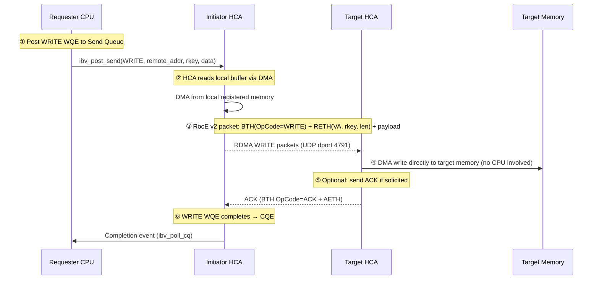
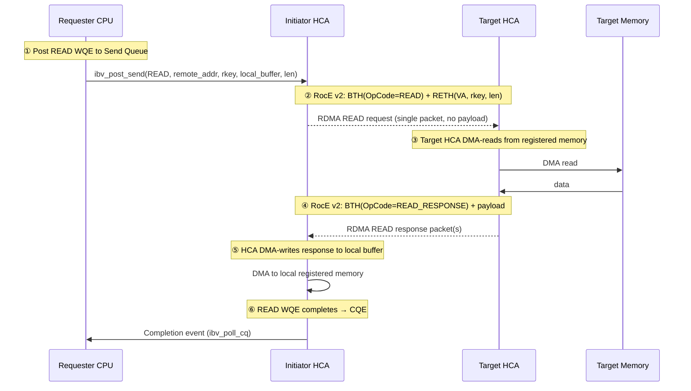
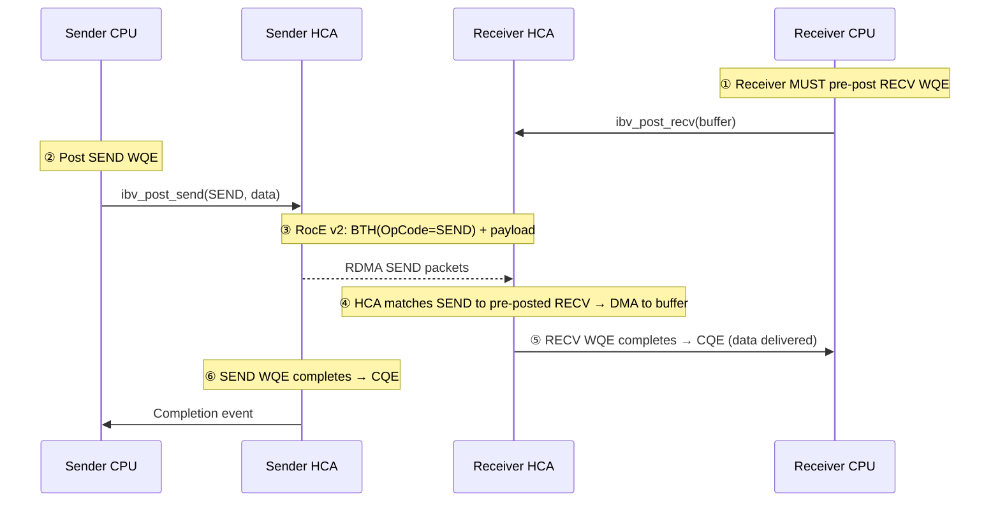
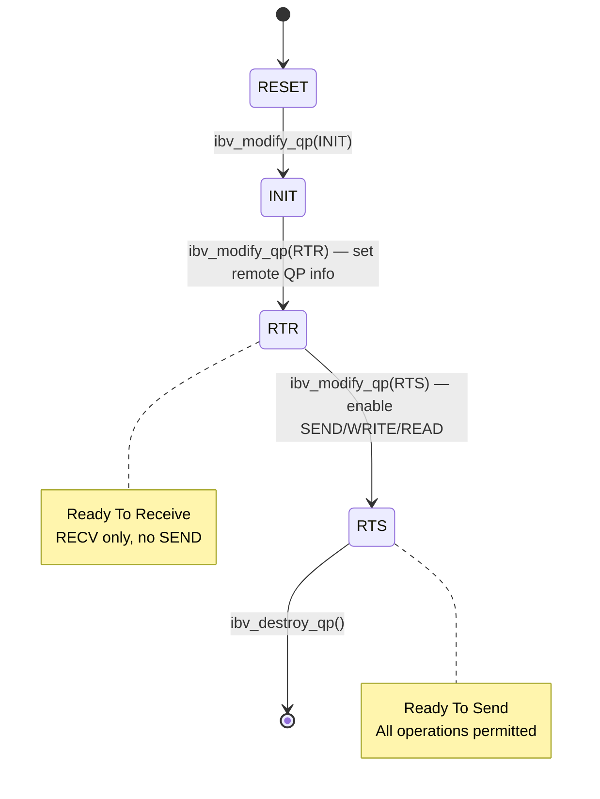

# RoCE — RDMA over Converged Ethernet

- RoCE is a network protocol that enables **Remote Direct Memory Access (RDMA)** over
  standard Ethernet, defined by the **InfiniBand Trade Association (IBTA)**, not the
  IETF. RDMA allows applications to read/write remote memory directly without
  involving the remote CPU, delivering microsecond-scale latency, near-zero CPU
  load, and line-rate bandwidth — benefits that drive its use in HPC, distributed
  storage, and AI/GPU training (see [ai-gpu-fabric.md](ai-gpu-fabric.md)).
- The authoritative specification is **IBTA Annex A17 (RoCE v2, 2014)**. There is no
  IETF RFC for RoCE; the IETF's RDMA-over-Ethernet standard is iWARP (RFC 5040) [1].
- **In practice, "RoCE" today means RoCE v2.** RoCE v1 (IBTA Annex A16, 2010) was an
  L2-only protocol (Ethertype `0x8915`, single broadcast domain, no congestion
  control beyond PFC) that proved RDMA-over-Ethernet was viable but has been
  supplanted entirely — the NIC/HCA and software ecosystem (NVIDIA ConnectX,
  Broadcom, Intel, libibverbs, UCX, NCCL/RCCL) converged on v2 years ago. A v1-only
  device is legacy hardware predating the v2 spec; there is no greenfield scenario
  where v1 would be recommended. The experimental "RoCE v1.5" variant was never
  standardized and is not relevant.
- RoCE v2 encapsulates the **InfiniBand Transport Layer** (Base Transport Header —
  BTH, Extended Transport Header — ETH, invariant CRC) inside **UDP/IP** (dest port
  `4791`), reusing InfiniBand's RDMA semantics (Queue Pairs, Work Requests,
  completion queues) without a TCP/IP stack in the data path. This makes v2
  IP-routable — hence "Routable RoCE" (RRoCE) — at the cost of requiring a lossless
  fabric underneath, since UDP provides no ordering guarantees and RoCE requires
  **in-order delivery** for packets sharing the same UDP source/destination.

## Lossless Ethernet

RoCE's central operational requirement is a **lossless Ethernet** fabric — packet
loss stalls RDMA operations and triggers Go-Back-N retransmission, which is
catastrophic for throughput. Three mechanisms work together:

- **PFC** (Priority Flow Control, 802.1Qbb) — per-priority-class pause, hop-by-hop,
  stops the transmitter before the receiver's buffer overflows. Without PFC, any
  buffer overflow drops packets and degrades RDMA throughput. However, PFC is prone
  to **head-of-line blocking** and, misconfigured, **PFC storms/deadlock** across
  the fabric [2].
- **ECN** (Explicit Congestion Notification, RFC 3168) [3] — switches mark IP packets
  when queue depth crosses a threshold, signaling congestion to receivers before
  buffers fill, reducing reliance on PFC as the sole congestion signal.
- **DCQCN** (Data Center Quantized Congestion Notification) — the receiver, on
  receiving an ECN-marked packet, sends a **CNP** (Congestion Notification Packet)
  back to the sender, which reduces its injection rate (multiplicative decrease,
  then additive increase similar to DCTCP)
  [4]. Tuning DCQCN parameters
  (Kmin/Kmax, Alpha, rate-reduction factor) is fabric-specific — default values
  rarely hold across different switch ASICs and buffer architectures.

DCB (Data Center Bridging) — 802.1Qaz ETS (Enhanced Transmission Selection) and
DCBX — is typically deployed alongside PFC to carve out a lossless traffic class
for RoCE while isolating it from lossy traffic classes. This adds operational
complexity vs. native InfiniBand, where lossless credit-based flow control is
built into the link layer with no separate configuration.

## Packet format

The RoCE v2 packet on the wire [5]:

```
+-----------+---------+----------+-----------------------------+------+------+
| Ethernet  | IPv4/v6 | UDP      | InfiniBand Transport         | ICRC | FCS  |
| 14B       | 20/40B  | 8B       | (BTH + optional ExtHdrs      | 4B   | 4B   |
|           |         | dport=4791|  + RDMA Payload)             |      |      |
+-----------+---------+----------+-----------------------------+------+------+
```

### Outer headers (standard Ethernet/IP/UDP)

- **Ethernet header** — standard 14-byte frame (DMAC + SMAC + Ethertype `0x0800` for
  IPv4 or `0x86DD` for IPv6).
- **IP header** — IPv4 (20B) or IPv6 (40B), with DSCP/ECN bits used for congestion
  marking (see [Congestion control](#congestion-control)). RoCE v2 requires the IP
  header's ECN field to be writable by switches — ECN-capable Transport (ECT) codepoint
  must be set.
- **UDP header** — 8 bytes, destination port `4791` (IANA-reserved for RoCE v2), source
  port varies per flow. The UDP checksum must be correct (not zero); RoCE v2 uses it for
  integrity of the outer headers.

### InfiniBand Transport (IB payload)

The UDP payload carries the InfiniBand transport layer, identical in format to native
InfiniBand packets [6]:

- **BTH** (Base Transport Header, 12 bytes) — always present. Contains:
  - **OpCode** (1 byte) — RDMA operation type: SEND, RDMA WRITE, RDMA READ, ACK, etc.
  - **PSN** (Packet Sequence Number, 3 bytes) — per-QP sequence for in-order delivery
    and Go-Back-N retransmission detection.
  - **Destination QP** (3 bytes) — identifies the target Queue Pair on the receiver.
  - Additional control bits: solicited event, migration state, partition key index.

- **Optional Extended Transport Headers**, depending on OpCode:
  - **RETH** (RDMA Extended Transport Header) — for RDMA WRITE/READ: carries remote
    virtual address (64-bit), remote key (32-bit), and DMA length.
  - **AETH** (ACK Extended Transport Header) — for acknowledgments: syndrome code +
    MSN (Message Sequence Number).
  - **ImmDt** (Immediate Data, 4 bytes) — for RDMA WRITE with immediate: 32-bit
    value delivered inline to the receiver on completion.
  - **Atomic headers** — for atomic operations (compare-and-swap, fetch-and-add).
  - **DETH** (Datagram Extended Transport Header) — for unreliable datagram QPs.

- **RDMA Payload** — 0 to ~4KB of application data (bounded by Path MTU minus headers).

- **ICRC** (Invariant Cyclic Redundancy Check, 4 bytes) — computed over the fields
  that must not change in flight (BTH through payload), independent of the Ethernet
  FCS. Detects data corruption introduced by intermediate devices.

### FCS vs ICRC

The Ethernet **FCS** (Frame Check Sequence, 4 bytes) covers the entire Ethernet frame
and is regenerated hop-by-hop by each switch. The **ICRC** is end-to-end — it covers
only the IB transport headers and payload, and survives across the fabric. A mismatch
on ICRC causes the receiver to silently drop the packet (no NACK in the base protocol;
Go-Back-N retransmission is triggered by a missing PSN at the sender).

### v1 vs v2 encapsulation difference

RoCE v1 uses Ethertype `0x8915` and places the IB transport directly after the
Ethernet header (no IP/UDP). RoCE v2 wraps the same IB transport inside
`Ethernet → IP → UDP(dport 4791) → IB Transport`. The IB transport payload (BTH,
optional headers, ICRC) is bit-identical between v1 and v2 — only the outer
encapsulation differs.

### ECMP and ordering

Because ECMP hashes the 5-tuple (src/dst IP, src/dst port, protocol), all packets
belonging to the same QP flow take the same path — satisfying RoCE's in-order
delivery requirement — as long as the fabric doesn't change ECMP hash configuration
or experience a link-state change that redistributes flows (see [Operational
considerations](#operational-considerations)).

## RDMA operations

RoCE uses the InfiniBand Verbs model [7]:
operations are posted to **Queue Pairs** (QPs) consisting of a Send Queue and a
Receive Queue. Completion events land in a **Completion Queue** (CQ). The HCA
executes the wire protocol without CPU involvement. The Verbs API is exposed in
userspace by **libibverbs** [8]
from the `rdma-core` project, with kernel bypass provided by the `ib_uverbs`
interface [9].

### RDMA Write (one-sided — target CPU never sees the data)



- **Key property**: The target CPU is never interrupted. Data lands in pre-registered
  memory without any software involvement on the target side. This is the workhorse
  of GPU collective operations (e.g., NCCL uses WRITE for all-reduce ring exchanges).
- The Requester must know the target's virtual address and **rkey** (remote key) —
  obtained via out-of-band exchange or RDMA SEND of connection metadata.
- WRITE is **not acknowledged by default** — the sender gets no confirmation the data
  arrived. Solicited WRITE (with the SE bit in BTH) triggers an ACK; unsolicited
  WRITE is fire-and-forget.

### RDMA Read (one-sided — the initiator pulls data from the target)



- READ is **fully one-sided** — neither the Requester CPU nor the Target CPU touches
  the data path. The Target HCA serves the read purely from its registered memory
  regions.
- READ has **higher latency** than WRITE (request + response round trip), so WRITE is
  preferred when the initiator knows the data and the target's buffer. READ is
  essential for distributed shared-memory models and MPI one-sided operations.
- READ response packets carry a PSN and are subject to the same in-order delivery
  and Go-Back-N retransmission as WRITE.

### RDMA SEND/RECV (two-sided — both sides post work requests)



- RECV must be **pre-posted** — if a SEND arrives with no matching RECV, the
  connection is torn down (Retry Exceeded error). This is the fundamental
  difference from one-sided WRITE/READ.
- SEND/RECV is the mechanism for control-plane metadata exchange (connection
  establishment, memory region registration info) and small messages. It's the
  only way to deliver data to application-level receive buffers — WRITE/READ
  bypass them entirely.

### QP state machine



- **INIT**: Local QP configured (port, protection domain, max WR depth).
- **RTR** (Ready To Receive): Remote QP attributes known (QP number, LID/GID, port).
  Can receive but not send.
- **RTS** (Ready To Send): Full operation. SEND, WRITE, READ, and atomic ops are
  permitted. This is the steady-state operating mode.

## RoCE v2 vs. iWARP vs. InfiniBand

| | **RoCE (v2)** | **iWARP** | **InfiniBand** |
|---|---|---|---|
| **Network** | UDP/IP over Ethernet | TCP/IP over Ethernet | InfiniBand fabric |
| **Transport reliability** | Assumes lossless fabric (PFC); no transport-layer retransmit beyond Go-Back-N | TCP (inherently reliable, congestion-controlled) | Credit-based, lossless by design |
| **Routing** | IP-routable (v2) | IP-routable | Subnet-local (gateways for cross-subnet) |
| **Multicast** | Defined | Not defined | Defined |
| **Standard body** | IBTA | IETF (RFC 5040/5041/5044) | IBTA |
| **Vendors** | NVIDIA/Mellanox, Broadcom, Intel, AMD/Xilinx [2] | Chelsio, Intel (legacy) | NVIDIA/Mellanox |
| **Switch latency** | ~230 ns (typical DC Ethernet) [2] | Same as RoCE (same Ethernet fabric) | ~100 ns (equivalent port count) [2] |

- **RoCE wins** on operational commonality (same Ethernet fabric as the rest of the
  DC), multi-vendor interoperability, and cost at scale. It now dominates AI/GPU
  training cluster deployments outside the very largest (10K+ GPU) builds.
- **InfiniBand still leads** on out-of-box lossless behavior, adaptive routing
  maturity, and lowest latency for the largest training clusters.
- **iWARP** has largely lost mindshare — TCP's per-connection state and reliability
  overhead scale poorly at large node counts, and its multicast gap limits HPC/
  collective-operation use cases.

## Congestion control

- RoCE v2 specifies ECN-based congestion control: switches mark the ECN bits in the
  IP header when queue depth exceeds a configurable threshold, the receiver reflects
  this back to the sender via a CNP frame, and the sender rate-limits the affected
  QP (Queue Pair).
- **DCQCN** is the de-facto congestion-control algorithm implementing this, modeled
  on DCTCP but tuned for RDMA's bursty, loss-intolerant traffic patterns. Key knobs:
  - **Kmin/Kmax**: ECN marking thresholds (bytes or cells) — below Kmin, no marking;
    above Kmax, all packets marked; between them, probabilistic marking.
  - **Alpha**: EWMA weight for the congestion estimate — low alpha (e.g., 1/256)
    smooths transient bursts but reacts slowly; high alpha (e.g., 1/16) reacts
    fast but overshoots.
  - **Rate-reduction factor**: how aggressively the sender cuts its rate on
    receiving a CNP — typically multiplicative decrease by 0.5–0.95.
- **ECN + PFC interaction**: ECN/DCQCN aim to prevent PFC from triggering at all
  by backing off senders before buffers fill. When ECN is tuned correctly, PFC
  should only activate under pathological conditions (e.g., a slow receiver, a
  link flap). If PFC fires frequently, ECN thresholds are set too high relative to
  the buffer size, or the fabric is oversubscribed beyond what DCQCN can absorb.
- **Switch buffer architecture matters**: shared-buffer switches (Broadcom
  Jericho/Tomahawk, Cisco Silicon One) handle RoCE microbursts differently than
  per-port-buffer switches — shared buffers can absorb larger bursts if the pool
  isn't contended, but a single noisy flow can starve others. This directly
  affects where Kmin/Kmax should be set (see vendor-matrix for per-silicon
  guidance).

## Operational considerations

- **PFC deadlock risk**: a loop or misconfiguration in PFC can pause an entire
  traffic class indefinitely. DCB fabrics should always have a PFC watchdog/
  storm-control mechanism to detect and clear stuck pauses.
- **Buffer sizing**: RoCE demands deeper buffers than general-purpose DC traffic
  to absorb microbursts from RDMA writes. Switch buffer depth (per-port or shared)
  and the buffer-allocation profile (dedicated lossless class vs. shared pool) are
  critical design inputs — undersized buffers force PFC to trigger more often,
  cutting throughput.
- **NIC/HCA compatibility**: RoCE requires RDMA-capable NICs (ConnectX on the
  NVIDIA/Mellanox side, Broadcom NetXtreme-E, Intel E810, etc.). The NIC driver
  and firmware version matter — DCQCN parameters may be configured at the NIC,
  and mismatched firmware can produce silent throughput degradation.
- **Routing**: RoCE v2 packets are IP-routable, but ECMP hashing must preserve
  per-flow ordering (same 5-tuple → same path) to avoid out-of-order delivery.
  Any change to ECMP hash fields or link-state that rebalances flows can cause
  transient reordering and RDMA retransmission storms — plan fabric changes
  carefully.
- **Kernel bypass**: RoCE, like all RDMA protocols, bypasses the kernel TCP/IP
  stack entirely — applications use the **RDMA Verbs API** (libibverbs) or
  higher-level libraries (UCX, libfabric) that abstract the transport. This means
  standard socket-based tools (tcpdump for payload, netstat) don't see RoCE
  traffic at the application layer — debug requires RDMA-specific counters and
  tools (perftest, ib_write_bw, ibv_devinfo).

## Relationship to other techniques

- [ai-gpu-fabric.md](ai-gpu-fabric.md) — RoCE is the dominant transport for GPU
  collective communication (NCCL, RCCL) in Ethernet-based training clusters; the
  lossless-Ethernet requirements and rail-optimized topology are inseparable from
  RoCE's design constraints.
- [spine-leaf-clos.md](spine-leaf-clos.md) — RoCE fabrics typically use a
  non-blocking spine-leaf Clos underlay; oversubscription directly throttles
  collective-operation completion time and is generally avoided for RoCE
  workloads.
- [evpn.md](evpn.md) / [vxlan.md](vxlan.md) — EVPN-VXLAN overlays add
  encapsulation overhead and VTEP processing that is incompatible with RoCE's
  microsecond-latency target; RoCE traffic typically runs on the underlay,
  potentially in a dedicated VRF for isolation, rather than inside a VXLAN
  overlay.

## References

[1] "A Remote Direct Memory Access Protocol Specification," IETF RFC 5040, October 2007. [Online]. Available: https://www.rfc-editor.org/rfc/rfc5040

[2] "RDMA over Converged Ethernet," Wikipedia. [Online]. Available: https://en.wikipedia.org/wiki/RDMA_over_Converged_Ethernet

[3] "The Addition of Explicit Congestion Notification (ECN) to IP," IETF RFC 3168, September 2001. [Online]. Available: https://www.rfc-editor.org/rfc/rfc3168

[4] Y. Zhu et al., "Congestion Control for Large-Scale RDMA Deployments," in *Proc. ACM SIGCOMM*, 2015, pp. 523–536. [Online]. Available: https://dl.acm.org/doi/10.1145/2785956.2787484

[5] "FPGA Implementation of RoCEv2," EasyFPGA Blog, June 2025. [Online]. Available: https://easyfpga.blog/posts/fpga-implementation-of-rocev2/

[6] "RoCEv2 (RDMA over Converged Ethernet, version 2)," Yobitel Knowledge Base. [Online]. Available: https://yobitel.com/knowledge-base/rocev2

[7] "InfiniBand Architecture Specification," InfiniBand Trade Association. [Online]. Available: https://www.infinibandta.org/ibta-specification/

[8] "libibverbs — RDMA Verbs Userspace Library," rdma-core Documentation, Linux RDMA Project. [Online]. Available: https://github.com/linux-rdma/rdma-core/blob/master/Documentation/libibverbs.md

[9] "Userspace Verbs Access," Linux Kernel Documentation. [Online]. Available: https://docs.kernel.org/infiniband/user_verbs.html
