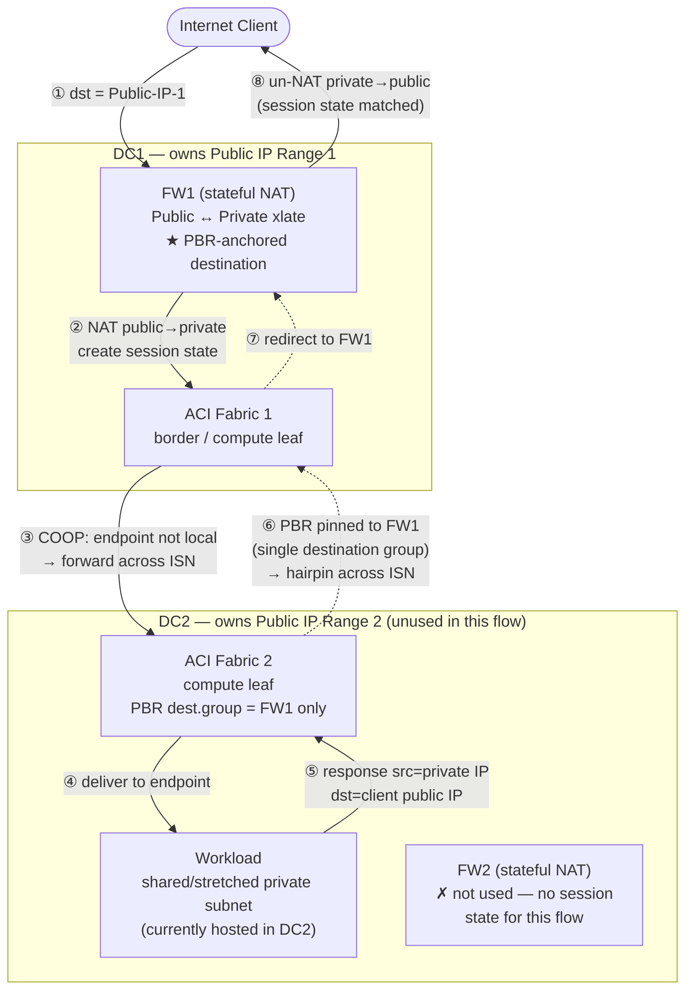

# Cisco ACI (APIC)

- ACI (Application Centric Infrastructure) is Cisco's SDN/policy-controller
  overlay for Nexus DC fabrics — APIC is the controller, EPGs/contracts are the
  declarative, application-profile-based policy model. See [cisco.md](cisco.md)
  for how this fits against [NX-OS-native EVPN-VXLAN](nxos-vxlan.md), and
  [techniques/evpn.md](../../techniques/evpn.md) /
  [techniques/vxlan.md](../../techniques/vxlan.md) for the underlying
  control/data plane ACI's fabric rides on.

## Release history

| Version | Year | Architecturally significant changes |
|---|---|---|
| 1.x | 2014 | First GA (1.0(1e), Aug 2014) — centralized APIC cluster, EPG/contract policy model, single-pod only. [ref](https://www.cisco.com/c/en/us/td/docs/switches/datacenter/aci/apic/sw/1-x/release/notes/apic_rn_101.html) |
| 2.x | 2016–17 | **Multi-Pod**: one APIC cluster spanning multiple pods over a routed inter-pod network (IPN). [ref](https://www.cisco.com/c/en/us/td/docs/switches/datacenter/aci/apic/sw/2-x/L3_config/b_Cisco_APIC_Layer_3_Configuration_Guide/b_Cisco_APIC_Layer_3_Configuration_Guide_chapter_010011.html) |
| 3.x | 2017 | **Multi-Site** — independent APIC fabric domains stitched via MP-BGP EVPN + Multi-Site Orchestrator; 3.1 added **Remote Leaf**. [ref](https://www.cisco.com/c/en/us/solutions/collateral/data-center-virtualization/application-centric-infrastructure/white-paper-c11-740861.html) |
| 4.x | 2018–19 | **Cloud APIC** / "ACI Anywhere" — hybrid extension to AWS (4.1), then Azure (4.2); 4.2 became a designated long-lived release. [ref](https://www.cisco.com/c/en/us/td/docs/switches/datacenter/aci/cloud-apic/4-x/install/Cisco-Cloud-APIC-Installation-Guide-Azure-42x/Cisco-Cloud-APIC-Installation-Guide-42x_chapter_01.html) |
| 5.x | 2020–21 | APIC-over-L3 (no L2 adjacency required for spine/APIC), rogue-endpoint detection; 5.2 was the other long-lived release, deepened Nexus Dashboard consolidation (MSO, Nexus Insights, Network Assurance Engine). [ref](https://www.cisco.com/c/en/us/td/docs/dcn/aci/apic/long-lived-release/aci-long-lived-release-5-2-x.html) |
| 6.x | 2023–2026 | Long-lived-release model retired starting 6.0; 6.1 added standards-based EVPN remote-leaf resiliency (replacing a Cisco-proprietary protocol) and ACI↔non-ACI VXLAN-EVPN interop ("Policy Extension"); **6.2 (latest, 6.2(2), ~Jul 2026)** adds hybrid physical/virtual APIC clusters, a hardened cluster-upgrade workflow, and expanded GPO flexibility. [ref](https://www.cisco.com/c/en/us/td/docs/dcn/aci/apic/6x/release-notes/cisco-apic-release-notes-622.html) |

Latest release: **APIC 6.2(2)** (~Jul 2026). No newer long-lived-release line
exists — 4.2(x) and 5.2(x) remain the only two in ACI's history.
[ref](https://www.cisco.com/c/en/us/td/docs/dcn/aci/apic/6x/release-notes/cisco-apic-release-notes-622.html)

See **[aci-vs-nxos-vxlan.md](aci-vs-nxos-vxlan.md)** for the head-to-head
comparison against NX-OS-native EVPN-VXLAN, including the 2026 Cisco
convergence ("Nexus One") update relevant to new builds.

## Multi-Site: stretched workload with per-site NAT

Instance of the general
[multi-site-workload-mobility.md](../../scenarios/multi-site-workload-mobility.md)
scenario: two ACI fabrics (one per DC), a shared/stretched private-IP subnet so
workloads can migrate between sites, but each site owns a **distinct** public
IP range behind its own independent NAT firewall. A workload can end up
physically hosted at a site other than the one whose public IP/firewall a
client used to reach it — and because NAT requires the return packet to hit
the *exact* device holding the translation entry (stricter than plain
stateful-firewall symmetry — a non-SYN, non-matching segment is dropped by the
implicit stateful check), the wrong firewall can't substitute even if it runs
an identical security policy.
[ref](https://www.cisco.com/c/en/us/solutions/collateral/data-center-virtualization/application-centric-infrastructure/white-paper-c11-743107.html)

**Why the default "local firewall" PBR pattern fails here:** ACI's usual
Multi-Site north-south firewall design anchors PBR to whichever site the
workload's compute leaf is on, so an independent, interchangeable firewall per
site can serve the flow.
[ref](https://www.cisco.com/c/en/us/solutions/collateral/data-center-virtualization/application-centric-infrastructure/white-paper-c11-743107.html)
That assumption breaks under NAT: the two firewalls are not interchangeable —
only the one that performed the original translation holds the session state.

**The fix — anchor PBR to one named device, not a local one:**
- A PBR **Redirect Policy** points at a **Destination Group** defined by an
  explicit **IP + MAC** (L3 mode) or **leaf/port/VLAN** (L1/L2 mode) — a named
  device interface, not a proximity-based role.
  [ref](https://www.cisco.com/c/en/us/td/docs/switches/datacenter/aci/apic/sw/4-x/L4-L7-services/Cisco-APIC-Layer-4-to-Layer-7-Services-Deployment-Guide-42x/b-Cisco-APIC-Layer-4-to-Layer-7-Services-Deployment-Guide-42x_chapter_01001.html)
- Since APIC 4.0(1), PBR enforcement for a contract is anchored at the
  **provider leaf** — applied consistently, for both directions of a flow,
  from the one configured destination group.
  [ref](https://www.cisco.com/c/en/us/solutions/collateral/data-center-virtualization/application-centric-infrastructure/white-paper-c11-743107.html)
- For this scenario: configure only **one** destination group for the
  contract — the NAT-owning firewall's inside-interface IP/MAC — with no
  local alternative defined at the other site. Every leaf enforcing that
  contract, regardless of site, then has exactly one legal PBR target,
  reached by hairpinning across the ISN when the workload sits elsewhere.

**Conclusion:** anchoring PBR to a single named device — accepting the
resulting cross-site hairpin on the return leg — is the correct, required fix,
not a routing defect to optimize away. It only applies to firewalls that are
PBR-reachable service-graph nodes through the fabric; it has no effect on
firewalls ACI has no L3 relationship with. If the hairpin cost is
unacceptable at scale, see
[multi-site-workload-mobility.md](../../scenarios/multi-site-workload-mobility.md#cross-cutting-judgment)
for the architectural alternatives (decouple workload mobility from public-IP
ownership, or use a NAT platform with cross-site state sync).
